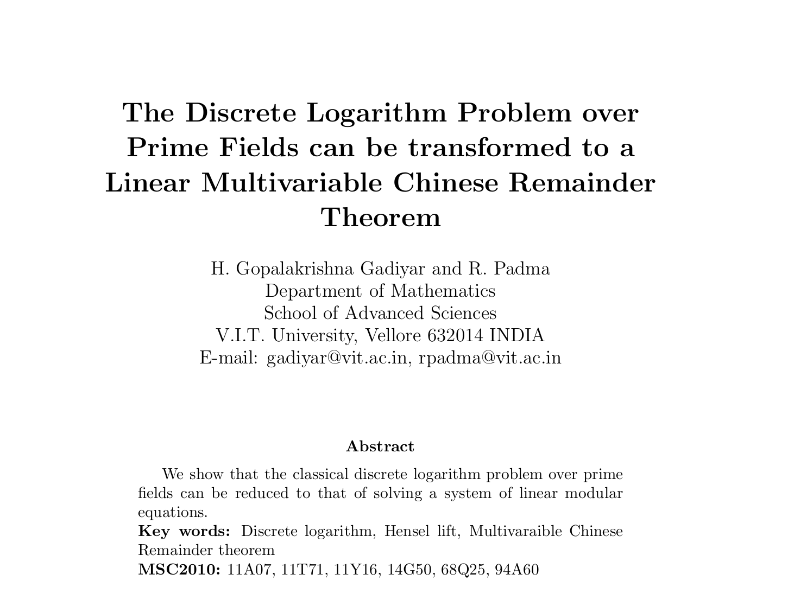

# The Discrete Logarithm Problem over Prime Fields to Multivariable Chinese Remainder Theorem
Unofficial [**LeetArxiv**](https://leetarxiv.substack.com/p/the-discrete-logarithm-problem-over) implementation of the paper 'The Discrete Logarithm Problem over Prime Fields can be Transformed to a Linear Multivariable Chinese Remainder Theorem' in C  code



Complete LeetArxiv walkthrough is [here](https://leetarxiv.substack.com/p/the-discrete-logarithm-problem-over)

## Paper Summary
The authors claim that the discrete logarithm problem can be transformed to the multivariable chinese remainder theorem using a formula given on page 4.

## Reproducability
We are able to reproduce the author's primary claim. However, this version of the paper contains an error we document in our walkthrough.

## Running the code
```
clear && gcc main.c -lm -o m.o && ./m.o 
```
